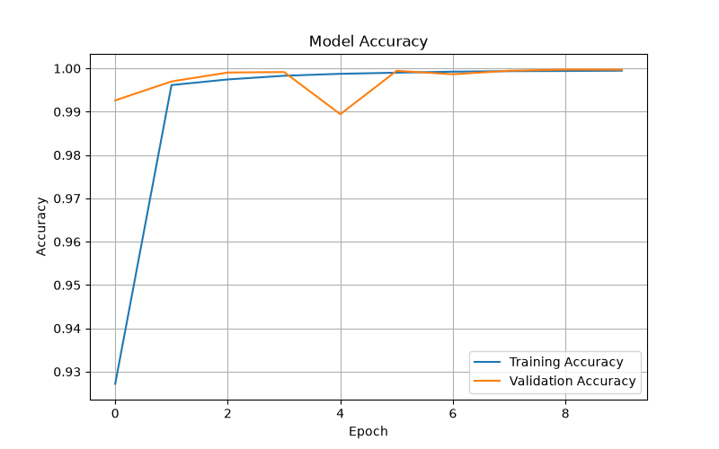
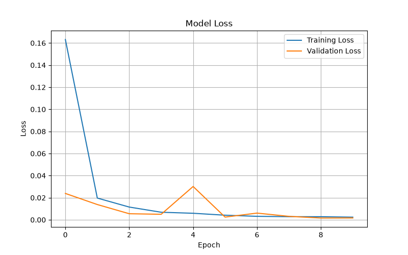
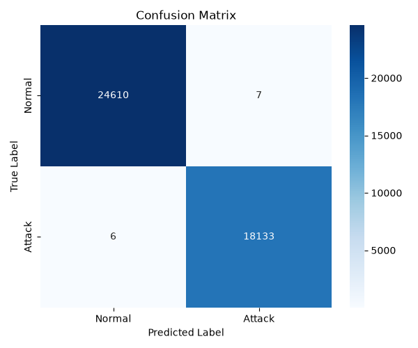
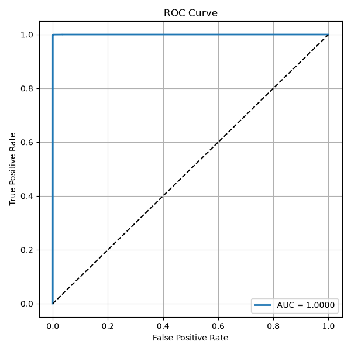

# 🛡️ CNN-LSTM Intrusion Detection System (IDS)


A Deep Learning-based Intrusion Detection System (IDS) developed using **Convolutional Neural Networks (CNN)** and **Long Short-Term Memory (LSTM)** to classify network traffic as **Normal** or **Attack** using the **CICIDS2017** dataset.

---

## 📌 Project Overview

Intrusion Detection Systems (IDS) play a crucial role in identifying malicious network activities and protecting computer networks from cyber attacks.

This project implements a hybrid **CNN-LSTM** model that:

- Detects malicious network traffic
- Classifies traffic into **Normal** and **Attack**
- Performs complete data preprocessing and feature engineering
- Evaluates model performance using multiple metrics
- Visualizes training and evaluation results
- Achieved **99.97% Accuracy**

---

## 🎯 Objectives

- Build a Deep Learning-based Intrusion Detection System
- Preprocess the CICIDS2017 dataset
- Perform feature engineering and normalization
- Train a CNN-LSTM model
- Evaluate the model using classification metrics
- Visualize training and testing performance

---

# 🏗️ Project Workflow

```
                 CICIDS2017 Dataset
                         │
                         ▼
                 Data Exploration
                         │
                         ▼
                 Data Preprocessing
                         │
                         ▼
                Feature Engineering
                         │
                         ▼
                  Feature Scaling
                         │
                         ▼
                 Train/Test Split
                         │
                         ▼
                 Data Reshaping
                         │
                         ▼
                  CNN-LSTM Model
                         │
                         ▼
                     Model Training
                         │
                         ▼
                    Model Evaluation
                         │
                         ▼
      Accuracy • Precision • Recall • F1 Score
            Confusion Matrix • ROC Curve
```

---

# 📂 Project Structure

```
CNN-LSTM/
│
├── dataset/
│   ├── raw/
│   └── processed/
│
├── models/
│
├── results/
│   └── plots/
│       ├── accuracy.png
│       ├── loss.png
│       ├── confusion_matrix.png
│       └── roc_curve.png
│
├── src/
│   ├── config.py
│   ├── explore_dataset.py
│   ├── preprocessing.py
│   ├── feature_engineering.py
│   ├── reshape_data.py
│   ├── model.py
│   ├── train.py
│   ├── evaluate.py
│   └── predict.py
│
├── .gitignore
├── README.md
├── requirements.txt
└── main.py
```

---

# 📊 Dataset

**Dataset Used**

- CICIDS2017
- Canadian Institute for Cybersecurity (CIC)

This project uses the **Machine Learning CSV** version of the dataset.

> **Note:** The dataset is not included in this repository due to its large size.

Download it from:

[CICIDS2017 Dataset](https://www.unb.ca/cic/datasets/ids-2017.html)

Place the downloaded CSV file inside:

```text
dataset/raw/
```


## 📋 Dataset Statistics

| Property | Value |
|----------|-------|
| Dataset | CICIDS2017 |
| Features | 78 |
| Classes | Normal, Attack |
| Training Samples | 171,021 |
| Testing Samples | 42,756 |

---

# 🧠 CNN-LSTM Architecture

```
Input Layer
      │
      ▼
1D Convolution Layer
      │
      ▼
Max Pooling Layer
      │
      ▼
Dropout
      │
      ▼
LSTM Layer
      │
      ▼
Dense Layer
      │
      ▼
Output Layer (Sigmoid)
```

---

# 🛠️ Technologies Used

- Python 3.11
- TensorFlow / Keras
- NumPy
- Pandas
- Scikit-learn
- Matplotlib
- Seaborn

---

# 📈 Model Performance

| Metric | Value |
|---------|-------|
| Accuracy | **99.97%** |
| Precision | **99.96%** |
| Recall | **99.97%** |
| F1 Score | **99.96%** |

---

# 📊 Generated Visualizations

The project generates the following evaluation plots:

- ✅ Accuracy Curve
- ✅ Loss Curve
- ✅ Confusion Matrix
- ✅ ROC Curve

---

## 📈 Accuracy Curve

<p align="center">
  
</p>

---

## 📉 Loss Curve

<p align="center">
  
</p>

---

## 🔲 Confusion Matrix

<p align="center">
  
</p>

---

## 📊 ROC Curve

<p align="center">
  
</p>

---

# 🚀 Installation

Clone the repository

```bash
git clone https://github.com/Ananjana246/CNN-LSTM
```

Create a virtual environment

```bash
python3 -m venv venv
```

Activate it

### macOS / Linux

```bash
source venv/bin/activate
```

Install dependencies

```bash
pip install -r requirements.txt
```

---

# ▶️ Running the Project

### Explore Dataset

```bash
python src/explore_dataset.py
```

### Data Preprocessing

```bash
python src/preprocessing.py
```

### Feature Engineering

```bash
python src/feature_engineering.py
```

### Train Model

```bash
python src/train.py
```

### Evaluate Model

```bash
python src/evaluate.py
```

### Predict Network Traffic

```bash
python src/predict.py
```

---


# 📁 Output

After successful execution, the project generates the following visualization files:

```text
results/
└── plots/
    ├── accuracy.png
    ├── loss.png
    ├── confusion_matrix.png
    └── roc_curve.png
```

---

# 📌 Results

The CNN-LSTM model successfully learned to distinguish between **Normal** and **Attack** traffic from the CICIDS2017 dataset.

The evaluation metrics indicate strong classification performance, making the model suitable as a proof-of-concept intrusion detection system.

---

# 🔮 Future Improvements

- Multi-class attack detection
- Real-time packet capture
- Streamlit dashboard
- Docker deployment
- Explainable AI (SHAP/LIME)
- Support for additional IDS datasets

---

# 👩‍💻 Author

**Ananjana K**

B.Tech – Computer Science and Engineering

**Skills**

- Python
- Deep Learning
- Machine Learning
- Cybersecurity
- TensorFlow
- Data Analysis

---
# 📚 References

1. Sharafaldin, I., Lashkari, A. H., & Ghorbani, A. A.
   Toward Generating a New Intrusion Detection Dataset and Intrusion Traffic Characterization.
   ICISSP, 2018.

2. [CICIDS2017 Dataset](https://www.unb.ca/cic/datasets/ids-2017.html)